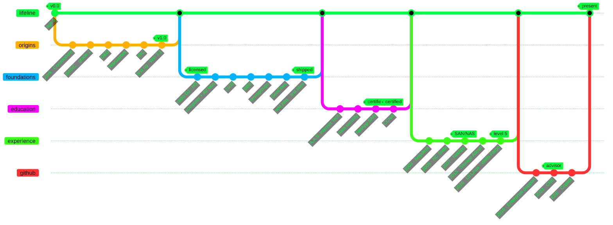

<!-- ░ stats · terminal green on black ░ -->

  
  

  

<!--
**melscoop/melscoop** is a ✨ _special_ ✨ repository because its `README.md` (this file) appears on your GitHub profile. 
--> 

- :books: Certified in GitHub Administration, Actions, Advanced Security - [Credly link](https://www.credly.com/users/melanie-cooper.d2d9baa3) & Azure AZ900

<!-- - RIP [Deb(Ian) Murdock](https://www.zdnet.com/article/debian-linux-founder-ian-murdock-dies-at-42-cause-unknown/) -->

---

---

  

  
  
  
  
  
  

---

Something to keep in mind for the future: Isaac Asimov's "Three Laws of Robotics" 
- A robot may not injure a human being or, through inaction, allow a human being to come to harm.
- A robot must obey orders given it by human beings except where such orders would conflict with the First Law.
- A robot must protect its own existence as long as such protection does not conflict with the First or Second Law.

never forget ... :fishsticks: :fishsticks: :fishsticks: :fishsticks: :fishsticks:
